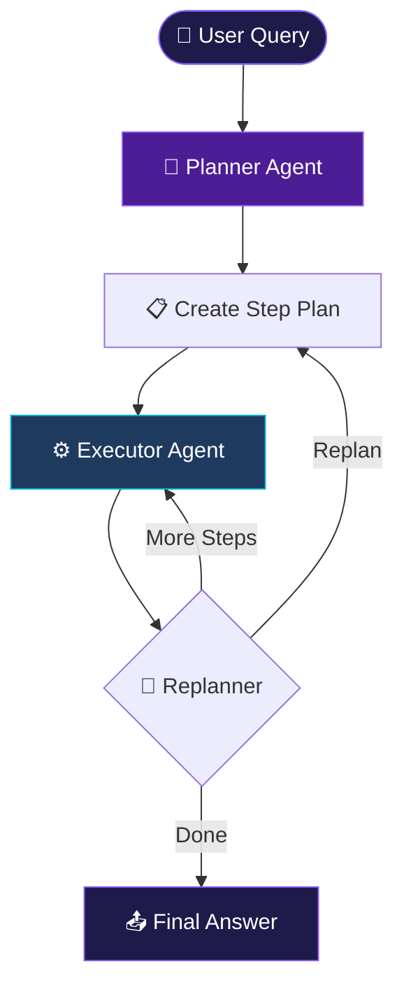
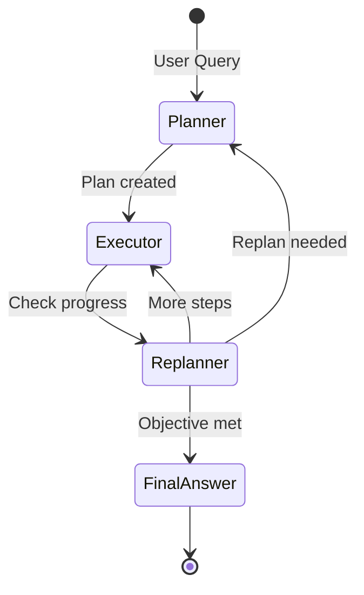
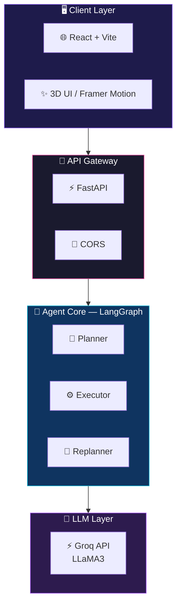

<div align="center">

<!-- Animated Banner -->


<!-- Typing Animation -->


<!-- Badges Row -->


<!-- Tech Stack Badges -->


<br/>

[🐛 Report Bug](https://github.com/AyushGU12/PLAN_AND_EXECUTE_AGENT/issues) &nbsp;·&nbsp;
[✨ Request Feature](https://github.com/AyushGU12/PLAN_AND_EXECUTE_AGENT/issues)

</div>

---


## 📋 Table of Contents

<details>
<summary>Click to expand full navigation</summary>

- [🎯 What Is This](#-what-is-this)
- [🧠 How It Works](#-how-it-works)
- [🏗️ System Architecture](#️-system-architecture)
- [⚡ Features](#-features)
- [🛠️ Tech Stack](#️-tech-stack)
- [📁 Project Structure](#-project-structure)
- [🚀 Quick Start](#-quick-start)
- [📡 API Reference](#-api-reference)
- [🤝 Contributing](#-contributing)
- [📜 License](#-license)

</details>


## 🎯 What Is This

<div align="center">

```
╔══════════════════════════════════════════════════════════════╗
║                                                              ║
║   Most AI tools give you a single-shot answer.              ║
║                                                              ║
║   This AI Agent creates a PLAN, executes each step,         ║
║   checks its own work, and REPLANS if needed.               ║
║                                                              ║
║   It is not a chatbot. It is an autonomous agent.           ║
║                                                              ║
╚══════════════════════════════════════════════════════════════╝
```

</div>

A production-grade autonomous AI agent built with **LangGraph** and a stunning 3D **React** UI. 
Instead of answering in a single shot, this agent:
- 🧠 **Plans** — Breaks your complex query into ordered steps
- ⚙️ **Executes** — Runs each step iteratively
- 🔄 **Replans** — Adapts the plan mid-execution if needed


## 🧠 How It Works

<div align="center">



</div>

### The Architecture Explained

<table>
  <tr>
    <th>Agent</th>
    <th>Role</th>
    <th>What It Does</th>
  </tr>
  <tr>
    <td>🧠 <b>Planner</b></td>
    <td>Strategist</td>
    <td>Breaks complex query into ordered steps in a Directed Acyclic Graph.</td>
  </tr>
  <tr>
    <td>⚙️ <b>Executor</b></td>
    <td>Worker</td>
    <td>Runs each step using specialized tools dynamically.</td>
  </tr>
  <tr>
    <td>🔄 <b>Replanner</b></td>
    <td>Evaluator</td>
    <td>Evaluates results and drafts a revised plan if a step fails or new info shifts the goal.</td>
  </tr>
</table>


## 🏗️ System Architecture

### Agent State Machine



### Full System Overview




## ⚡ Features

### Core AI Features
- ✅ **Plan-and-Execute Architecture** — Breaks complex queries into ordered steps
- ✅ **LangGraph State Machine** — Real graph-based agent orchestration
- ✅ **Dynamic Tool Selection** — Capable of picking the right tool for the job
- ✅ **Mid-Execution Replanning** — Agent adapts plan based on what it learns

### UI / UX Features
- ✅ **3D Particle Sphere** — Three.js animated background
- ✅ **Matrix Rain Effect** — Canvas-based falling characters
- ✅ **Glow Orb Animations** — Ambient purple/pink/cyan orbs
- ✅ **Live Plan Visualizer** — Watch each step execute in real-time
- ✅ **Glass Morphism Cards** — Backdrop-filter UI components
- ✅ **Neon Border Effects** — CSS glow animations
- ✅ **Framer Motion Transitions** — Smooth page and element animations


## 🛠️ Tech Stack

<div align="center">

### Frontend


### Backend


</div>

<br/>

| Layer | Technology | Purpose |
|-------|-----------|---------|
| **LLM** | Groq LLaMA3 | Core language model |
| **Agent Framework** | LangGraph | State machine agent orchestration |
| **Backend** | FastAPI | REST API server |
| **Frontend** | React + Vite | UI framework |
| **3D Graphics** | Three.js | 3D particle effects |
| **Animations** | Framer Motion | UI animations |
| **Styling** | TailwindCSS | Utility-first CSS |


## 📁 Project Structure

```text
📦 PLAN_AND_EXECUTE_AGENT
│
├── 📂 frontend/                 ← React Vite 3D UI
│   ├── 📂 src/
│   │   ├── 📂 components/       ← UI Components (Hero, Visualizer, etc)
│   │   ├── 📜 App.jsx           ← Main UI Routing
│   │   └── 📜 index.css         ← Tailwind styling
│   └── 📜 package.json
│
├── 📂 src/                      ← Backend LangGraph Core
│   ├── 📂 agents/               ← Planner, Executor, Replanner
│   ├── 📂 graph/                ← Workflow State and Graph Logic
│   └── 📂 tools/                ← Agent Tools
│
├── 📜 main.py                   ← Graph Compilation
├── 📜 api.py                    ← FastAPI Server
└── 📜 requirements.txt          ← Python Dependencies
```


## 🚀 Quick Start

### Option A — Run Backend (FastAPI + LangGraph)

```bash
# 1. Clone the repository
git clone https://github.com/AyushGU12/PLAN_AND_EXECUTE_AGENT.git
cd PLAN_AND_EXECUTE_AGENT

# 2. Create virtual environment
python -m venv venv
venv\Scripts\activate        # Windows
# source venv/bin/activate   # Mac/Linux

# 3. Install dependencies
pip install -r requirements.txt

# 4. Setup environment variables
# Create a .env file and add your GROQ_API_KEY
# GROQ_API_KEY=your_key_here

# 5. Start backend
uvicorn api:app --reload
```

### Option B — Run Frontend (React 3D UI)

```bash
# 1. Navigate to frontend folder
cd frontend

# 2. Install Node dependencies
npm install

# 3. Start Vite Dev Server
npm run dev
# The stunning 3D UI will be available at http://localhost:5173
```


## 📡 API Reference

| Method | Endpoint | Description |
|--------|----------|-------------|
| `POST` | `/api/chat/ask` | Run Plan-Execute agent |
| `GET`  | `/api/health` | Check API health |

<details>
<summary>📋 POST /api/chat/ask — Example</summary>

**Request:**
```json
{
  "query": "Compare quicksort and mergesort"
}
```

**Response:**
```json
{
  "answer": "## Quicksort vs Mergesort\n\n...",
  "steps_taken": ["Plan created", "Step 1 done", "Step 2 done"]
}
```

</details>


## 🤝 Contributing

Contributions are what make this project extraordinary.

```bash
# 1. Clone your fork
git clone https://github.com/AyushGU12/PLAN_AND_EXECUTE_AGENT.git

# 2. Create feature branch
git checkout -b feature/AmazingFeature

# 3. Commit with emoji convention
git commit -m "✨ Add AmazingFeature"

# 4. Push and open PR
git push origin feature/AmazingFeature
```


## 📜 License

Distributed under the MIT License.

See [`LICENSE`](LICENSE) for full text.


## 📬 Connect

<div align="center">

[](https://linkedin.com/in/AyushGU12)
[](https://twitter.com/AyushGU12)
[](mailto:ayush@example.com)

</div>

<div align="center">


<br/>

<p>Made with ❤️ by <a href="https://github.com/AyushGU12">Ayush</a></p>
<p>⭐ Star this repo if it helped you!</p>

<!-- Footer wave -->


</div>
